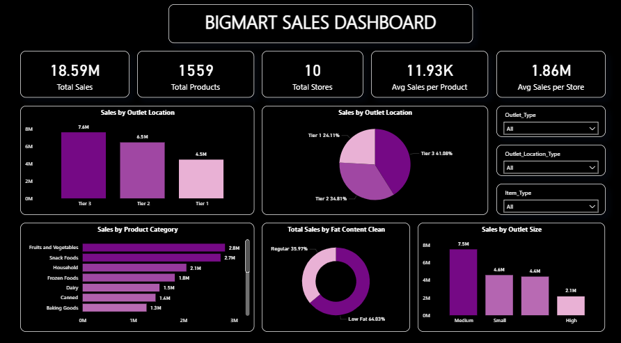
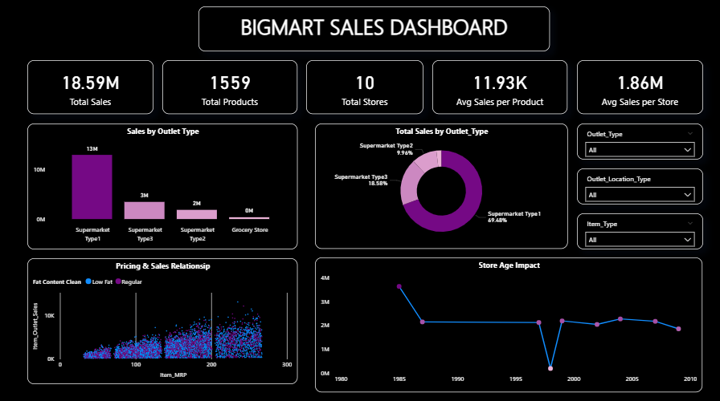

# 📊 BigMart Sales Dashboard

## 📌 Overview
This project analyzes retail sales data from BigMart using Power BI to uncover insights related to sales performance, product categories, and outlet characteristics.

---

## 🎯 Objectives
- Analyze sales distribution across outlet tiers and sizes  
- Identify top-performing product categories  
- Understand pricing impact (MRP vs Sales)  
- Evaluate outlet performance over time  

---

## 🛠️ Tools Used
- Power BI  
- Data Cleaning & Transformation  
- Data Visualization  

---

## 📈 Key Insights
- Tier 3 outlets contribute the highest sales  
- Medium-sized outlets perform better overall  
- Low-fat products dominate total sales  
- Positive relationship between MRP and sales  

---

## 📷 Dashboard Preview

---

## 📁 Files Included
- `Bigmart_Sales_Dashboard.pbix`
- `bigmart.csv`

---

## 🚀 How to Use
1. Download the `.pbix` file  
2. Open it using Power BI Desktop  
3. Explore the dashboard interactively  

---

## 📬 Contact
Open to feedback and collaboration.
